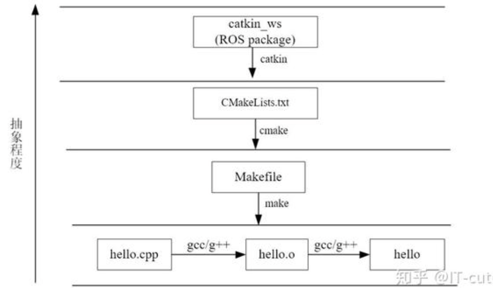

编译系统：  
代码变成可执行文件，叫做编译（compile）；先编译这个，还是先编译那个（即编译的安排），叫做构建（build）。Make是最常用的构建工具。
makefile定义了一系列的规则来指定哪些文件需要先编译，哪些文件需要后编译，哪些文件需要重新编译，甚至于进行更复杂的功能操作，Make命令依赖makefile进行构建，make解释makefile中的命令

CMake是一个跨平台的安装（编译）工具，可以用简单的语句来描述所有平台的安装(编译过程)。他能够输出各种各样的makefile或者project文件。
catkin是ros定制的编译构建系统，对cmake的扩展。支持大体量工作。工作空间是一个文件夹，以catkin工具进行编译构建。Catkin就是将cmake与make指令做了一个封装从而完成整个编译过程的工具

编译命令是在工作空间下catkin_make

文件系统：
ros的 Catkin 编译系统的一个特点是将程序做成 package (称为 catkin package 或者 ROS package) 的形式，可以理解成模块化,一个包可能会有很多个节点（node）。 
典型的 ROS workspace 中包含 src, build, devel 三个文件夹，在分享时只需要分享 src 中的某个 package 即可，所有的编译信息都在此 package 中。

典型的 ROS workspace 中包含 src, build, devel 三个文件夹，在分享时只需要分享 src 中的某个 package 即可，所有的编译信息都在此 package 中。

